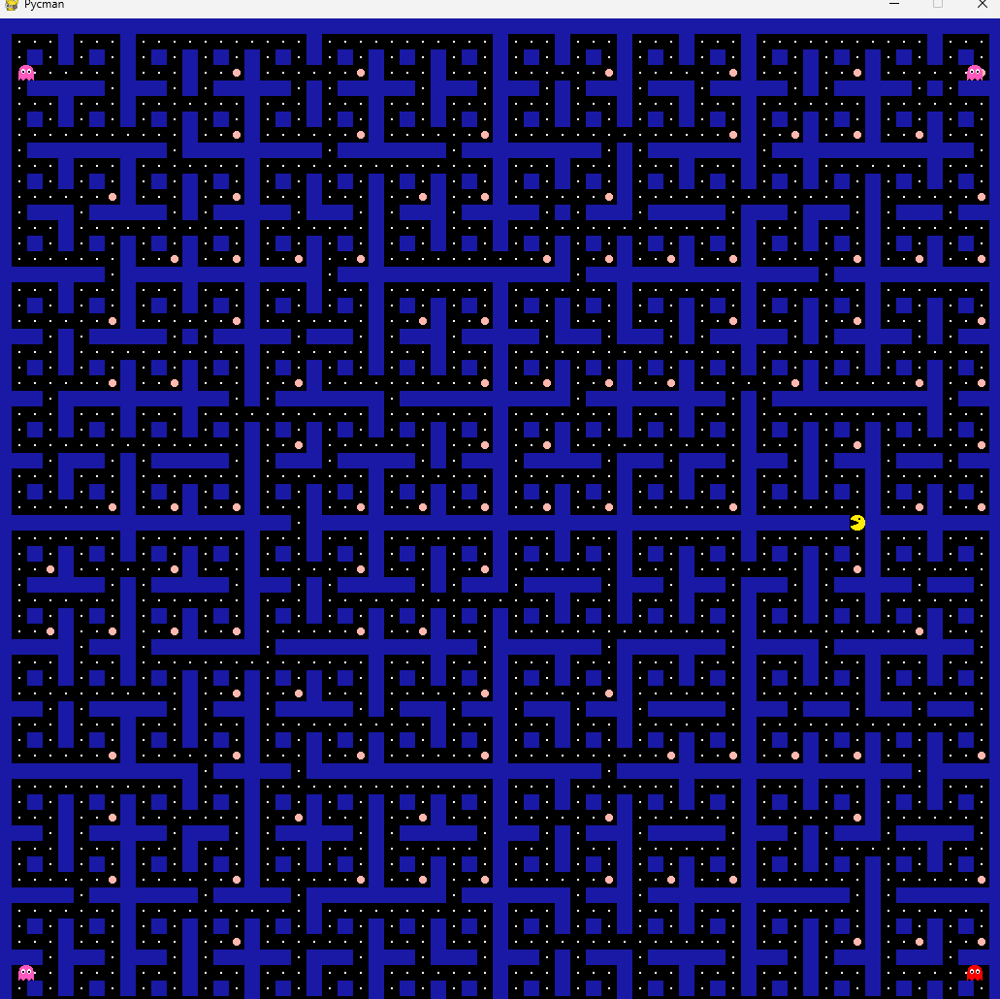
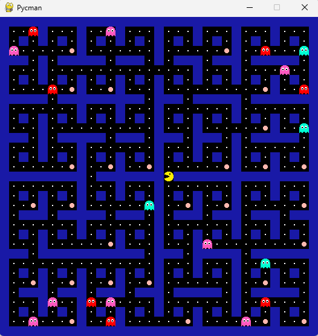
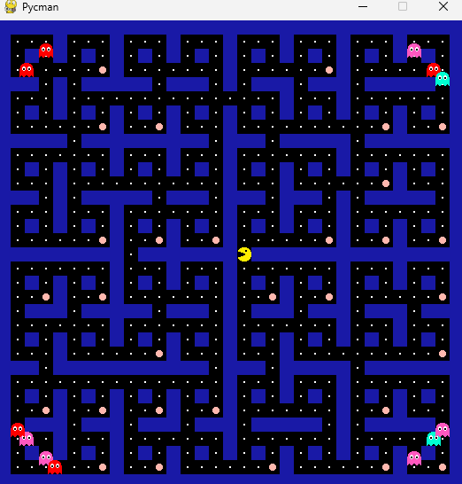
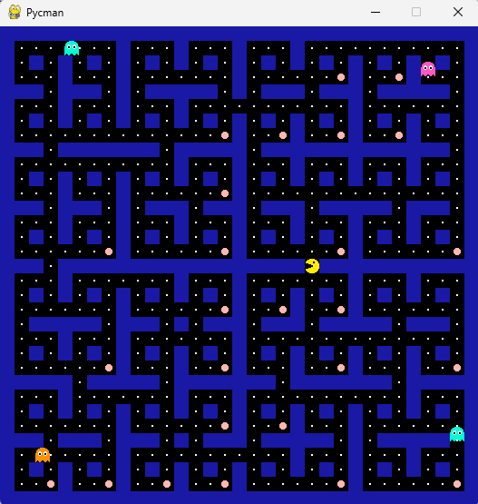

# University Assignment: Pacman – Modular Ghost Game

This project was developed as part of a university assignment. The objective was to implement a game following a predefined **framework specification**, which imposes certain constraints on the game mechanics. The project was completed within a one-month period.

---

## Game Overview

The implemented game is modular and incorporates the following mechanics:

* **Game Field Generation:**
  The game field is constructed based on the input parameter `n_1` according to:

  ```
  Field size = 2^n_1 + 1
  ```

The field is recursively generated from a base pattern and incorporates semi-random elements to increase variability.

* **Enemy Mechanics:**
The game features `n_2` autonomous ghosts. Their movement is independent and follows predefined behavioral rules. Interaction with the player follows the standard game mechanics.

* **Power-Up Mechanics:**
* Collection of a power-up reduces ghost speed.
* The player becomes temporarily invincible upon power-up acquisition.

* **Game Termination:**
Collision with a ghost without an active power-up results in the player's death and termination of the game.

---

## Project Structure

The project is structured to promote modularity:

```
/src
  movement_player_ghost.py   # Enemy behavior and player movement logic
  create_Labyrinth.py        # Recursive semi-random labyrinth generation
  pos_player_ghosts.py       # Initial placement of the player and ghosts
  /assets                    # Images and demonstration media for documentation
  /bilder                    # Contains all player and ghost sprites
  main.py                    # Main program initiating the game
  README.md                  # Project documentation
```

---

## Features

* Recursive field generation with stochastic elements
* Configurable number of ghost enemies
* Power-up system influencing player invincibility and ghost velocity
* Modular codebase allowing extensibility and reuse

---

## Screenshots

The following images illustrate the game interface and progression:

<p float="left">
  
  
</p>

<p float="left">
  
  
</p>

---

## Demonstration Video

A demonstration of the game can be accessed via the following video:

[Demo Video](assets/demo.mp4)

*Note: Direct video embedding in GitHub README is limited; the link provides access to the local video file.*

---

## Development Timeline

The project was implemented over a **one-month period** in accordance with the assignment specifications.

---

## Technical Notes

The game's mechanics are intentionally constrained by the assignment's framework. Consequently, certain behaviors differ from conventional implementations of the game. These constraints guided both the design decisions and algorithmic implementations.

The game behavior differs slightly from standard implementations due to the **university-assigned constraints**, which shaped the mechanics and design choices.
